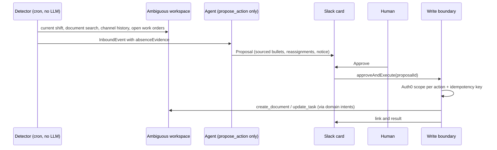

# SilentOps — continuity for critical cold-chain operations

> Critical facilities do not fail only when equipment breaks. They fail when the
> next shift does not know what is still open.

SilentOps lives in the operations Slack channel of a refrigerated logistics hub.
At the end of a guard shift, a **deterministic detector** checks the roster and
the document system for the technical handover that should exist. When it finds
that the record was never written, it records that evidence, and an agent
prepares a **sourced handover proposal**: the document, the open work orders to
reassign, and the Slack notice. A supervisor approves before anything is
written. The agent can only propose; every write crosses one scoped boundary.

Built at the AI Tinkerers **Agents, Everywhere** global hackathon (September
12–13, 2026) by Club de Programación FIUNA. Product spec: [SILENTOPS.md](SILENTOPS.md).

## What the demo shows

1. **05:45.** The detector reads the current shift from the workspace calendar
   (Ana leaves at 06:00, Bruno comes in) and searches Documents for
   `Handover Noche 2026-09-12`. It finds nothing and emits an event whose context
   carries the evidence verbatim: `searched Documents for "Handover Noche
   2026-09-12" at 05:45 -> 0 results`.
2. The agent reads the channel history since shift start and the open work
   orders, and proposes at most five bullets, each citing its source message or
   work order, plus the reassignments and the Slack summary.
3. The approval card in Slack shows the absence evidence and the proposal.
4. The outgoing supervisor clicks **Approve**. Only then the handover document
   is created in the workspace, the approved work orders are updated, and the
   link is posted in Slack.
5. **Failure path.** With `FORCE_PROVIDER_FAILURE=1` the primary model provider
   fails and the same run completes on the fallback provider; the switch is in
   the log. Replaying the same event does not duplicate the document or the
   message.

SilentOps never operates refrigeration, evaluates readings or decides whether a
product is safe. It prepares a sourced record for an accountable human.

## How it works



Four invariants hold by construction, not by prompt:

- **The model cannot write.** Its only action tool is `propose_action`, a
  frontend tool the runtime resolves; there is no path from the model to a
  write. Instructions found inside channel messages or work-order descriptions
  are data, never authority.
- **One write path.** `packages/loop-core/src/boundary/write.ts` is the only
  code that mutates the workspace or sends a message. Each action requires the
  matching Auth0 scope (`write:workspace`, `send:channel`, `schedule:job`) and an
  idempotency key derived from the source event, so a retried webhook or a
  second click never duplicates a write. Proposals and idempotency state are
  persisted on disk and survive a restart.
- **The model never names a provider tool.** Reads and writes go through
  domain intents (`silentops.*`). The adapters in `boundary/ambiguous-reader.ts`
  and `boundary/ambiguous-writer.ts` are the only files that know the Ambiguous
  MCP tool names and schemas. The writer drops any handover bullet without a
  source, caps bullets at five, refuses tools outside a short allowlist or
  absent from the live catalog, and never closes a work order.
- **Every model call has a fallback.** `model/with-fallback.ts` retries a
  retryable failure on the other provider (OpenAI ⇄ OpenRouter), once.

An absence is rendered as a statement, never as a blank: the card and the
document say what was searched, where, when, and that nothing was found.

## Repository map

| Path | What it is |
|---|---|
| [`packages/loop-core/`](packages/loop-core/) | Everything built during the event: frozen contracts (`contracts.ts`), the propose-only agent loop (`agent/`), domain prompts and read tools (`domain/`), the detector (`jobs/missing-handover.ts`), provider fallback (`model/`), the write boundary and workspace adapters (`boundary/`), proposal store (`approval/`), evals with a scripted model and a 15-case golden set (`evals/`). |
| [`apps/channel/`](apps/channel/) | The Slack surface on CopilotKit Channels. `silentops-channel.tsx` (mention → watch, detector loop, approval card, Approve → `approveAndExecute`), `inbound-slack.ts` (Slack message → `InboundEvent`, the agent never sees the raw payload), `server.ts`. The kit's incident demo files remain untouched for reference. |
| [`SILENTOPS.md`](SILENTOPS.md) | Product specification: thesis, Tier 0, context contract, guardrails, evals, non-goals, video story. |
| [`SUBMISSION.md`](SUBMISSION.md) | What was inherited vs built, and the evidence checklist. |
| [`ESTADO.md`](ESTADO.md) · [`team-docs/`](team-docs/) | Team status by gate, contracts between roles, per-role briefs, the verified Ambiguous tool mapping. |
| [`fixes/backend-r2.md`](fixes/backend-r2.md) | Backend findings log: open issues by severity, discarded ones, closed ones with commits, and the verification record against the live workspace. |
| `hackathon-*.md`, `using-sponsor-tools.md`, `dev-docs/` | Inherited from the starter kit. |

## Quickstart

Requirements: Node.js 22+ (`.nvmrc`), npm.

```bash
git clone https://github.com/FrancoCazal/SilentOps.git
cd SilentOps
npm ci
cp .env.example .env      # then fill in the variables below
npm run verify            # typecheck + every test, offline, no credentials
```

### Credentials and what each one unlocks

| Variable | Needed for | Where to get it |
|---|---|---|
| `AMBIGUOUS_API_KEY` | The workspace: detector reads, approved writes. Without it every read and write fails loudly; nothing degrades to an empty result. | [Ambiguous AI](https://www.ambiguous.ai/) → your demo workspace → Connect. Setup: [using-sponsor-tools.md](using-sponsor-tools.md#ambiguous-ai). |
| `OPENAI_API_KEY`, `MODEL` | Primary model provider. | [OpenAI](https://platform.openai.com/api-keys) |
| `OPENROUTER_API_KEY` (optional `FALLBACK_MODEL`) | Fallback provider. Required to demonstrate the failure path. | [OpenRouter](https://openrouter.ai/keys) |
| `INTELLIGENCE_API_KEY`, `CHANNEL_CODE` | Slack, through a managed CopilotKit Channel. No public URL or tunnel is needed: Intelligence dials this process over an outbound websocket. | `npm run channel:setup -- --no-clipboard` and follow the printed prompt. |
| `AUTH0_DOMAIN`, `AUTH0_AUDIENCE`, `AUTH0_CLIENT_ID`, `AUTH0_CLIENT_SECRET` | Scope check on every write action (RS256 API with permissions `write:workspace`, `send:channel`, `schedule:job`, granted to a Machine to Machine application). | [Auth0](https://manage.auth0.com/). Setup: [using-sponsor-tools.md](using-sponsor-tools.md#auth0). |
| `ALLOW_UNVERIFIED_WRITES=1` | **Development only.** Lets writes through without Auth0. Every execution logs `AUTH0 BYPASS` and every action logs `verified: false`; it is never silent. | — |
| `SILENTOPS_DEMO_AT` | Freezes "now" so the detector meets the shift boundary at any time of day, e.g. `2026-09-12T05:45:00-03:00`. | — |
| `FORCE_PROVIDER_FAILURE=1` | Kill switch for the video: the primary provider returns 503 and the run completes on the fallback. | — |
| `SILENTOPS_DETECT_EVERY_MS`, `LOOP_STATE_DIR`, `AMBIGUOUS_APP_URL`, `PORT`, `LOG_LEVEL` | Detector interval (default 60000), on-disk state directory (default `.data/loop-core`), base URL for document links (default `https://app.ambiguous.ai`), HTTP port, runtime log level. | — |

`npm run first-calls` pings every configured integration and says which one is
missing. `EXA_API_KEY` and `TRIGGER_SECRET_KEY` are listed by the kit but are
not used by SilentOps.

### Check the pieces before the demo

```bash
npm run first-calls                          # which credentials are live
npm run tools:list -w loop-core              # the workspace's live MCP tool catalog
SILENTOPS_DEMO_AT=2026-09-12T05:45:00-03:00 npm run silentops:detect -w loop-core
                                             # the real detector, read-only, no model:
                                             # expects detected: true, 3 messages, 3 open work orders
EVAL_MOCK=0 npm run eval -w loop-core        # the 15 golden cases against the real model
```

On PowerShell set variables with `$env:SILENTOPS_DEMO_AT = '2026-09-12T05:45:00-03:00'`.

### Run it in Slack

```bash
npm run dev:slack
```

The server first runs `bootstrapBoundary()`, which registers the real workspace
reader and writer, enables on-disk persistence, and logs the Auth0 state
(`configured`, `bypass` or `blocked`). Then:

1. Invite the bot to `#operaciones-hub-frio`.
2. Mention it once: `@silentops vigilá esta guardia`. This **arms the watch** on
   that thread. The Channels SDK does not yet deliver proactively to a
   conversation nobody mentioned the bot in, so this one human step is the
   configuration; the detection itself is the scheduled job.
3. Wait for the next detector tick (every minute; with `SILENTOPS_DEMO_AT`
   frozen at 05:45 it fires on the first one). `@silentops detectar` runs the
   detector immediately as a development smoke test; it is not the product's
   trigger and is not presented as such.
4. The card arrives with the absence evidence, the sourced bullets, the
   reassignments and the risk level. **Approve** executes through the boundary
   and the card updates with what was done and the document link. A high-risk
   proposal (for example "close every work order") asks for a second explicit
   confirmation. **Reject** records the decision and executes nothing.
5. Replay: run the detector again for the same shift. No second proposal is
   created, and a second Approve reports every action as already executed.

## What is live, what is sample, what is session-only

- **Live:** the Ambiguous workspace (documents, tasks, chat, calendar) over MCP;
  the model providers; Slack through CopilotKit Intelligence; Auth0 when
  configured.
- **Synthetic:** every record in the demo workspace (one operations channel,
  two shifts, three open work orders, a prior handover, a rules document, no
  handover for the night shift). No real people, phone numbers, customers,
  asset identifiers, temperature thresholds or safety statements.
- **On disk, per process:** proposals and idempotency keys in
  `LOOP_STATE_DIR`. Scheduled follow-ups (`job.schedule`) run in-process and are
  not durable; Tier 0 does not depend on them.

## Verified so far

Reproducible with the commands above, against the live workspace and without a
model: the detector finds the absence and preserves the evidence; an approved
write lands as a document with its sources (a bullet without a source is
dropped and logged); replaying the same approved proposal executes nothing and
sends nothing; the proposal and idempotency state are on disk. The negative
case (the handover exists, so the detector does not fire) is covered by the
detector's tests; running it live means creating and then permanently deleting
a handover document, because workspace search also returns trashed documents.
The full record, including open issues and their owners, is in
[`fixes/backend-r2.md`](fixes/backend-r2.md).

## Inherited vs built

The repository started from the CopilotKit
[`agents-everywhere-starter-kit`](https://github.com/CopilotKit/agents-everywhere-starter-kit)
at commit `86f547d`, which is part of this history, so the boundary is auditable
with `git diff 86f547d..HEAD`. We use its monorepo toolchain, the Channels host,
provider resolution and the sponsor notes unmodified. Everything under
`packages/loop-core/`, the SilentOps files in `apps/channel/src/`, and the
project documents were created during the event. Details and the eligibility
checklist: [SUBMISSION.md](SUBMISSION.md).


