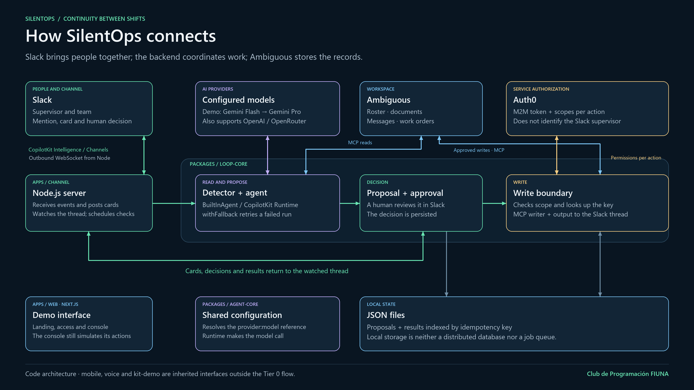
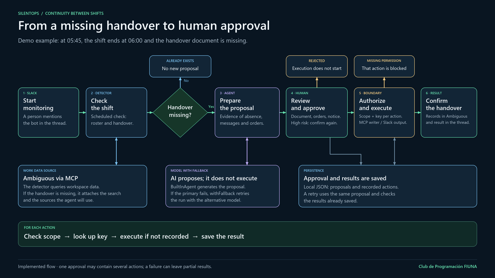

# SilentOps demo diagrams

English slides for presenting the system architecture and the handover workflow.
PNG files are 3840 × 2160 (16:9); SVG files can be scaled without losing quality.

## Architecture



[Download SVG](01-arquitectura-silentops.svg)

## Handover workflow



[Download SVG](02-flujo-handover-silentops.svg)

The diagrams describe the implemented code. The web console is a demo interface;
Auth0 authorizes the service and does not identify the Slack supervisor.

With the web app running, open `/diagramas/01-arquitectura-silentops.png` or
`/diagramas/02-flujo-handover-silentops.png`. Press F11 to present in full screen.

To regenerate locally on Windows with Python and Pillow installed:

```powershell
python demo/diagramas/generar-diagramas.py
Copy-Item demo/diagramas/*.png apps/web/public/diagramas/
```
